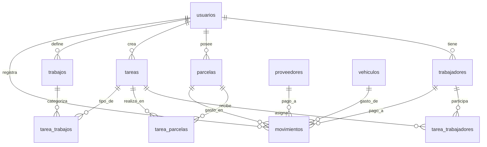

# Análisis de la Base de Datos - Sistema de Gestión Agrícola

## 📊 Resumen General

La base de datos `u873002419_campo` es un sistema de gestión agrícola que permite administrar trabajadores, parcelas, tareas, trabajos y movimientos financieros. El sistema está diseñado para un usuario específico (ID: 4) y maneja múltiples entidades relacionadas con la agricultura.

## 🗂️ Estructura de Tablas

### 👥 **Gestión de Usuarios**
- **`usuarios`**: Usuarios del sistema
  - `id`, `name`, `email`, `password`, `created_at`, `updated_at`

### 👷 **Gestión de Trabajadores**
- **`trabajadores`**: Información de trabajadores
  - `id`, `nombre`, `dni`, `ss`, `telefono`, `id_user`
  - **Datos actuales**: 23 trabajadores registrados

### 🌱 **Gestión de Parcelas**
- **`parcelas`**: Información de parcelas agrícolas
  - `id`, `nombre`, `olivos`, `ubicacion`, `empresa`, `propietario`, `hidrante`, `descripcion`, `id_user`
  - **Datos actuales**: 41 parcelas registradas

### ⚙️ **Gestión de Trabajos y Tareas**
- **`trabajos`**: Tipos de trabajos disponibles
  - `id`, `nombre`, `id_user`
  - **Datos actuales**: 57 tipos de trabajos (desnate, riego, abono, etc.)

- **`tareas`**: Tareas específicas realizadas
  - `id`, `fecha`, `descripcion`, `horas`, `created_at`, `updated_at`, `id_user`
  - **Datos actuales**: 36 tareas registradas

- **`tarea_trabajadores`**: Relación tareas-trabajadores
  - `id`, `tarea_id`, `trabajador_id`, `horas_asignadas`, `created_at`

- **`tarea_parcelas`**: Relación tareas-parcelas
  - `id`, `tarea_id`, `parcela_id`, `superficie_trabajada`, `created_at`

- **`tarea_trabajos`**: Relación tareas-tipos de trabajo
  - `id`, `tarea_id`, `trabajo_id`, `horas_trabajo`, `precio_hora`, `created_at`

### 💰 **Gestión Financiera**
- **`movimientos`**: Movimientos financieros
  - `id`, `fecha`, `tipo` (ingreso/gasto), `concepto`, `categoria`, `importe`, `estado`, `proveedor_id`, `trabajador_id`, `vehiculo_id`, `parcela_id`

### 🏢 **Entidades Complementarias**
- **`empresas`**: Empresas relacionadas
- **`proveedores`**: Proveedores de servicios
- **`herramientas`**: Inventario de herramientas
- **`vehiculos`**: Gestión de vehículos

### 🔧 **Sistema de Cache y Sesiones**
- **`cache`**: Sistema de caché
- **`cache_locks`**: Bloqueos de caché
- **`sessions`**: Sesiones de usuario
- **`password_reset_tokens`**: Tokens de recuperación de contraseña
- **`migrations`**: Control de migraciones

## 🔗 Relaciones Principales



## 📈 Análisis de Datos Actuales

### Estadísticas Generales:
- **Trabajadores**: 23 registros
- **Parcelas**: 41 registros (total: ~8,000 olivos)
- **Tareas**: 36 registradas
- **Tipos de Trabajo**: 57 categorías
- **Movimientos**: 3 registros financieros

### Distribución de Parcelas:
- **Mayor parcela**: "Las cajas (San Jose)" - 738 olivos
- **Menor parcela**: "Platerilla Estaca del abuelo (pequeño)" - 45 olivos
- **Promedio**: ~195 olivos por parcela

## 🚀 Mejoras Sugeridas para el Sistema

### 1. **Optimización de Estructura de Datos**

#### 🔧 **Corrección de Tipos de Datos**
```sql
-- Problema: Campo 'nombre' en empresas es INT en lugar de VARCHAR
ALTER TABLE empresas MODIFY nombre VARCHAR(255) NOT NULL;
ALTER TABLE empresas MODIFY dni VARCHAR(20) NOT NULL;
```

#### 📅 **Añadir Campos de Auditoría**
```sql
-- Añadir timestamps a todas las tablas principales
ALTER TABLE trabajadores ADD COLUMN created_at TIMESTAMP DEFAULT CURRENT_TIMESTAMP;
ALTER TABLE trabajadores ADD COLUMN updated_at TIMESTAMP DEFAULT CURRENT_TIMESTAMP ON UPDATE CURRENT_TIMESTAMP;

ALTER TABLE parcelas ADD COLUMN created_at TIMESTAMP DEFAULT CURRENT_TIMESTAMP;
ALTER TABLE parcelas ADD COLUMN updated_at TIMESTAMP DEFAULT CURRENT_TIMESTAMP ON UPDATE CURRENT_TIMESTAMP;
```

### 2. **Mejoras en Gestión de Trabajadores**

#### 👤 **Campos Adicionales**
```sql
ALTER TABLE trabajadores ADD COLUMN apellidos VARCHAR(255);
ALTER TABLE trabajadores ADD COLUMN fecha_nacimiento DATE;
ALTER TABLE trabajadores ADD COLUMN direccion TEXT;
ALTER TABLE trabajadores ADD COLUMN email VARCHAR(255);
ALTER TABLE trabajadores ADD COLUMN especialidad VARCHAR(255);
ALTER TABLE trabajadores ADD COLUMN fecha_contratacion DATE;
ALTER TABLE trabajadores ADD COLUMN estado ENUM('activo', 'inactivo', 'suspendido') DEFAULT 'activo';
ALTER TABLE trabajadores ADD COLUMN salario_base DECIMAL(10,2);
ALTER TABLE trabajadores ADD COLUMN foto VARCHAR(500);
```

#### 💰 **Sistema de Pagos Mejorado**
```sql
-- Tabla para historial de pagos
CREATE TABLE pagos_trabajadores (
    id INT PRIMARY KEY AUTO_INCREMENT,
    trabajador_id INT NOT NULL,
    fecha_pago DATE NOT NULL,
    concepto VARCHAR(255),
    importe DECIMAL(10,2) NOT NULL,
    horas_trabajadas DECIMAL(5,2),
    precio_hora DECIMAL(10,2),
    estado ENUM('pendiente', 'pagado', 'cancelado') DEFAULT 'pendiente',
    created_at TIMESTAMP DEFAULT CURRENT_TIMESTAMP,
    FOREIGN KEY (trabajador_id) REFERENCES trabajadores(id) ON DELETE CASCADE
);
```

### 3. **Mejoras en Gestión de Parcelas**

#### 📊 **Información Técnica**
```sql
ALTER TABLE parcelas ADD COLUMN superficie DECIMAL(10,2); -- en hectáreas
ALTER TABLE parcelas ADD COLUMN referencia_catastral VARCHAR(50);
ALTER TABLE parcelas ADD COLUMN tipo_cultivo ENUM('olivo', 'almendro', 'cereales', 'otros');
ALTER TABLE parcelas ADD COLUMN fecha_plantacion DATE;
ALTER TABLE parcelas ADD COLUMN rendimiento_anual DECIMAL(10,2); -- kg/año
ALTER TABLE parcelas ADD COLUMN ultima_cosecha DATE;
ALTER TABLE parcelas ADD COLUMN kilos_ultima_cosecha DECIMAL(10,2);
```

#### 📸 **Gestión de Documentos**
```sql
CREATE TABLE documentos_parcelas (
    id INT PRIMARY KEY AUTO_INCREMENT,
    parcela_id INT NOT NULL,
    tipo ENUM('foto', 'catastro', 'informe', 'contrato', 'otros'),
    nombre_archivo VARCHAR(255),
    ruta_archivo VARCHAR(500),
    descripcion TEXT,
    fecha_subida TIMESTAMP DEFAULT CURRENT_TIMESTAMP,
    FOREIGN KEY (parcela_id) REFERENCES parcelas(id) ON DELETE CASCADE
);
```

### 4. **Sistema de Tareas Mejorado**

#### ⏰ **Control de Tiempo**
```sql
ALTER TABLE tareas ADD COLUMN fecha_inicio DATETIME;
ALTER TABLE tareas ADD COLUMN fecha_fin DATETIME;
ALTER TABLE tareas ADD COLUMN estado ENUM('planificada', 'en_progreso', 'completada', 'cancelada') DEFAULT 'planificada';
ALTER TABLE tareas ADD COLUMN prioridad ENUM('baja', 'media', 'alta', 'urgente') DEFAULT 'media';
ALTER TABLE tareas ADD COLUMN observaciones TEXT;
```

#### 🎯 **Sistema de Objetivos**
```sql
CREATE TABLE objetivos_tareas (
    id INT PRIMARY KEY AUTO_INCREMENT,
    tarea_id INT NOT NULL,
    objetivo VARCHAR(255),
    cantidad_objetivo DECIMAL(10,2),
    unidad VARCHAR(50),
    cantidad_realizada DECIMAL(10,2) DEFAULT 0,
    fecha_objetivo DATE,
    FOREIGN KEY (tarea_id) REFERENCES tareas(id) ON DELETE CASCADE
);
```

### 5. **Sistema Financiero Avanzado**

#### 💳 **Gestión de Presupuestos**
```sql
CREATE TABLE presupuestos (
    id INT PRIMARY KEY AUTO_INCREMENT,
    nombre VARCHAR(255),
    año INT NOT NULL,
    categoria ENUM('ingresos', 'gastos', 'inversiones'),
    importe_presupuestado DECIMAL(12,2),
    importe_real DECIMAL(12,2) DEFAULT 0,
    created_at TIMESTAMP DEFAULT CURRENT_TIMESTAMP
);
```

#### 📊 **Análisis de Rentabilidad**
```sql
CREATE TABLE analisis_rentabilidad (
    id INT PRIMARY KEY AUTO_INCREMENT,
    parcela_id INT,
    año INT NOT NULL,
    ingresos DECIMAL(12,2) DEFAULT 0,
    gastos DECIMAL(12,2) DEFAULT 0,
    beneficio DECIMAL(12,2) GENERATED ALWAYS AS (ingresos - gastos),
    rentabilidad_porcentaje DECIMAL(5,2) GENERATED ALWAYS AS ((ingresos - gastos) / ingresos * 100),
    FOREIGN KEY (parcela_id) REFERENCES parcelas(id) ON DELETE SET NULL
);
```

### 6. **Sistema de Notificaciones**

#### 🔔 **Alertas y Recordatorios**
```sql
CREATE TABLE notificaciones (
    id INT PRIMARY KEY AUTO_INCREMENT,
    usuario_id BIGINT NOT NULL,
    tipo ENUM('tarea', 'pago', 'mantenimiento', 'cosecha', 'otro'),
    titulo VARCHAR(255),
    mensaje TEXT,
    fecha_recordatorio DATETIME,
    estado ENUM('pendiente', 'leida', 'archivada') DEFAULT 'pendiente',
    created_at TIMESTAMP DEFAULT CURRENT_TIMESTAMP,
    FOREIGN KEY (usuario_id) REFERENCES usuarios(id) ON DELETE CASCADE
);
```

### 7. **Sistema de Reportes**

#### 📈 **Vistas para Análisis**
```sql
-- Vista de resumen de trabajadores
CREATE VIEW vista_trabajadores_resumen AS
SELECT 
    t.id,
    t.nombre,
    t.dni,
    COUNT(tt.tarea_id) as total_tareas,
    SUM(tt.horas_asignadas) as total_horas,
    COALESCE(SUM(m.importe), 0) as total_pagado
FROM trabajadores t
LEFT JOIN tarea_trabajadores tt ON t.id = tt.trabajador_id
LEFT JOIN movimientos m ON t.id = m.trabajador_id AND m.tipo = 'gasto'
GROUP BY t.id;

-- Vista de rendimiento por parcela
CREATE VIEW vista_rendimiento_parcelas AS
SELECT 
    p.id,
    p.nombre,
    p.olivos,
    COUNT(tp.tarea_id) as total_tareas,
    SUM(t.horas) as total_horas_trabajo,
    COALESCE(SUM(m.importe), 0) as total_inversion
FROM parcelas p
LEFT JOIN tarea_parcelas tp ON p.id = tp.parcela_id
LEFT JOIN tareas t ON tp.tarea_id = t.id
LEFT JOIN movimientos m ON p.id = m.parcela_id AND m.tipo = 'gasto'
GROUP BY p.id;
```

### 8. **Mejoras de Seguridad**

#### 🔐 **Auditoría de Cambios**
```sql
CREATE TABLE auditoria_cambios (
    id INT PRIMARY KEY AUTO_INCREMENT,
    tabla VARCHAR(100),
    registro_id INT,
    accion ENUM('INSERT', 'UPDATE', 'DELETE'),
    valores_anteriores JSON,
    valores_nuevos JSON,
    usuario_id BIGINT,
    fecha_cambio TIMESTAMP DEFAULT CURRENT_TIMESTAMP
);
```

#### 🛡️ **Roles y Permisos**
```sql
CREATE TABLE roles (
    id INT PRIMARY KEY AUTO_INCREMENT,
    nombre VARCHAR(100),
    descripcion TEXT
);

CREATE TABLE permisos (
    id INT PRIMARY KEY AUTO_INCREMENT,
    nombre VARCHAR(100),
    descripcion TEXT
);

CREATE TABLE usuario_roles (
    usuario_id BIGINT,
    rol_id INT,
    PRIMARY KEY (usuario_id, rol_id),
    FOREIGN KEY (usuario_id) REFERENCES usuarios(id),
    FOREIGN KEY (rol_id) REFERENCES roles(id)
);
```

### 9. **Integración con APIs Externas**

#### 🌤️ **Datos Meteorológicos**
```sql
CREATE TABLE datos_meteorologicos (
    id INT PRIMARY KEY AUTO_INCREMENT,
    fecha DATE NOT NULL,
    temperatura_max DECIMAL(5,2),
    temperatura_min DECIMAL(5,2),
    precipitacion DECIMAL(5,2),
    humedad DECIMAL(5,2),
    viento_velocidad DECIMAL(5,2),
    parcela_id INT,
    FOREIGN KEY (parcela_id) REFERENCES parcelas(id) ON DELETE SET NULL
);
```

#### 📱 **Sistema de Geolocalización**
```sql
ALTER TABLE parcelas ADD COLUMN coordenadas_lat DECIMAL(10, 8);
ALTER TABLE parcelas ADD COLUMN coordenadas_lng DECIMAL(11, 8);
ALTER TABLE parcelas ADD COLUMN poligono_coordenadas JSON; -- Para formas irregulares
```

### 10. **Optimización de Rendimiento**

#### 📊 **Índices Adicionales**
```sql
-- Índices para consultas frecuentes
CREATE INDEX idx_tareas_fecha ON tareas(fecha);
CREATE INDEX idx_movimientos_fecha ON movimientos(fecha);
CREATE INDEX idx_tarea_trabajadores_trabajador ON tarea_trabajadores(trabajador_id);
CREATE INDEX idx_tarea_parcelas_parcela ON tarea_parcelas(parcela_id);
CREATE INDEX idx_parcelas_propietario ON parcelas(propietario);
CREATE INDEX idx_trabajadores_nombre ON trabajadores(nombre);
```

## 🎯 Prioridades de Implementación

### **Fase 1 - Crítico (1-2 semanas)**
1. Corregir tipos de datos incorrectos
2. Añadir campos de auditoría básicos
3. Implementar sistema de pagos a trabajadores
4. Añadir información técnica a parcelas

### **Fase 2 - Importante (1 mes)**
1. Sistema de notificaciones
2. Gestión de documentos
3. Reportes básicos
4. Mejoras en interfaz de usuario

### **Fase 3 - Deseable (2-3 meses)**
1. Sistema de roles y permisos
2. Integración con APIs externas
3. Análisis avanzado de rentabilidad
4. Sistema de auditoría completo

## 📋 Conclusión

El sistema actual tiene una base sólida pero necesita mejoras significativas en:
- **Integridad de datos**: Corrección de tipos y campos faltantes
- **Funcionalidad**: Sistema de pagos y gestión financiera
- **Usabilidad**: Mejores reportes y análisis
- **Escalabilidad**: Roles, permisos y auditoría
- **Integración**: APIs externas y datos meteorológicos

Estas mejoras convertirían el sistema en una herramienta completa de gestión agrícola profesional.
